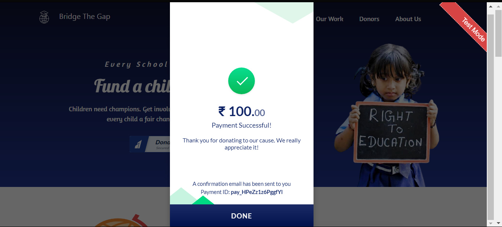

# Payment Gateway Integration

## Introduction

> <b><em>Task:</b></em> Developing A responsive Donation Website comprising of Payment Gateway Integration through Razorpay for donating any specific amount of money directly to "Bridge The Gap" Initiative.

## Tech Stack & Hosting

## About:

> <h3>Project name: <em>Bridge The Gap</em></h3>
> <h3><em>Website link: </em> https://bridgethegap01.netlify.app/ </h3>

## Screenshots and gifs of the website:

:heavy_check_mark: Home

:heavy_check_mark: Mission

:heavy_check_mark: Our Work

:heavy_check_mark: Donors

:heavy_check_mark: About us

:money_with_wings: Razorpay payment button on the home page allows you to donate any sum of money through various payment options

:email: E-mail received on succesful transaction

:iphone: Responsive view on mobile  

<h3>THANK YOU for visiting my repository :relaxed:</h3>
